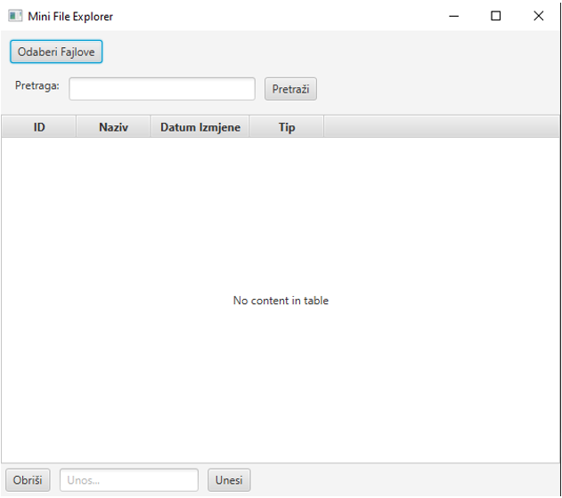
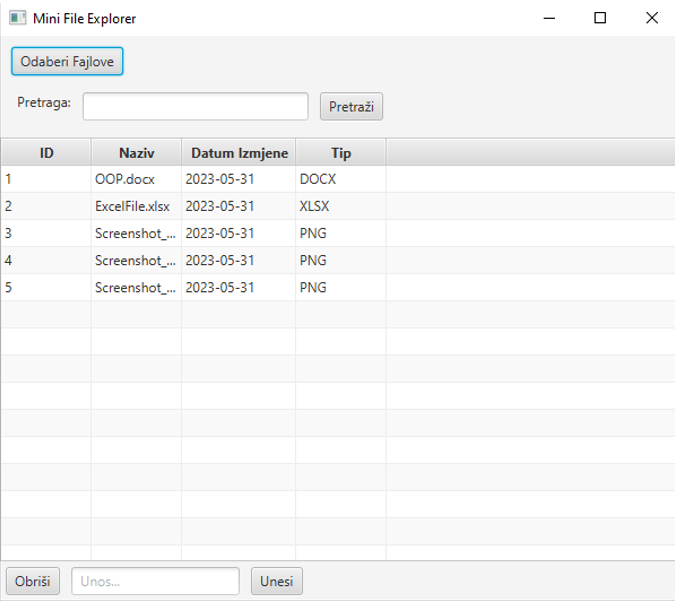
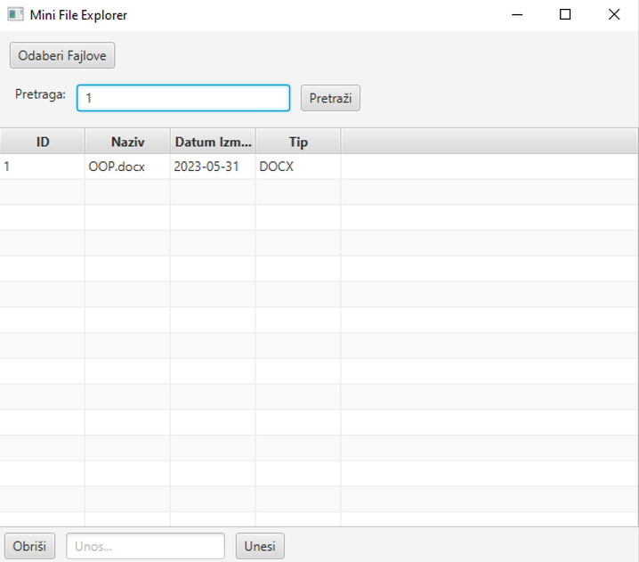
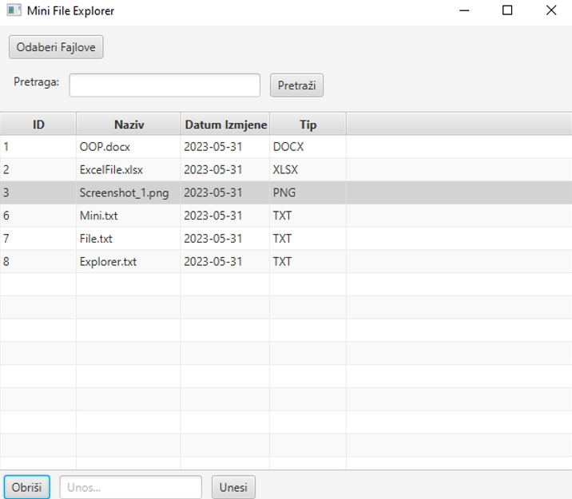

# MiniFileExplorer


## Project Overview
This is a mini project in java that I have done long time ago.
MiniFileExplorer is a Java-based desktop application created as part of a seminar project. The application uses Scene Builder to provide a user-friendly interface for managing files. Users can add files, view details such as file type, and name, and perform operations such as searching, deleting, and adding files with custom names and extensions.

### Features

* File Addition: Users can add files to the explorer, which are then displayed with their name, type (extension).
* Search by ID: The application allows users to search for files by their unique ID.
* File Deletion: Users can delete files from the system.
* Custom File Naming: Users can insert new files with custom names and extensions.
* File Information Display: For each added file, the application displays information like the file type (e.g., .exe, .txt), and name.

### Installation

To set up and run this project locally, you will need:
  * Java Development Kit (JDK) version 8 or above
  * Scene Builder (optional for UI changes)

### Backend

1. Clone the repository:
```
git clone https://github.com/husejn09/MiniFileExplorer.git
```
2. Navigate to the project root:
```
cd MiniFileExplorer
```
3. Compile the project (if you haven't already):
```
javac Main.java
```
4. Run the application:
```
java Main
```

### UI Customizations (Optional)
If you'd like to modify the UI using Scene Builder, you can open the FXML files and make your changes.

### Usage
Once the application is running:
 * Add Files: Use the file explorer to add files
 * View File Details: The file name, type (extension) will be displayed
 * Search by ID: Enter a file ID to search for a specific file
 * Delete Files: Select files to delete
 * Insert CustomFiles: Insert files with your preferred name and extension.

### Screenshots

* Interface


* Insert of files


* Searching files by ID


* Deletion of files

  
### License

This project is licensed under the MIT License - see the [LICENSE](/LICENSE) file for details.
